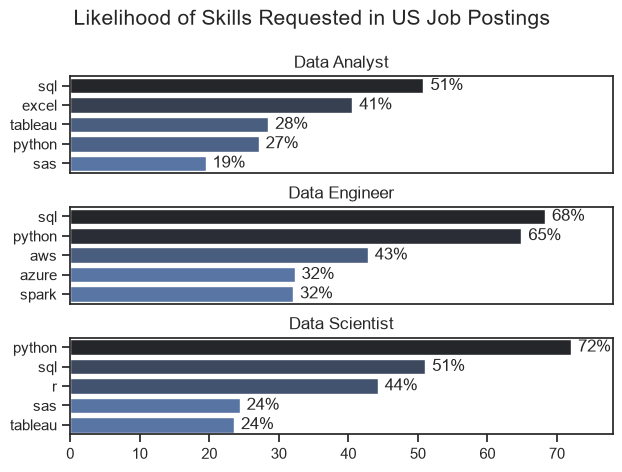
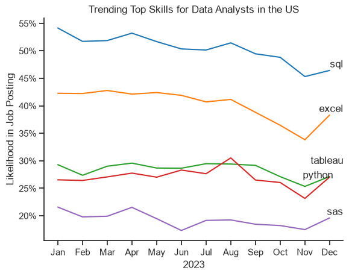
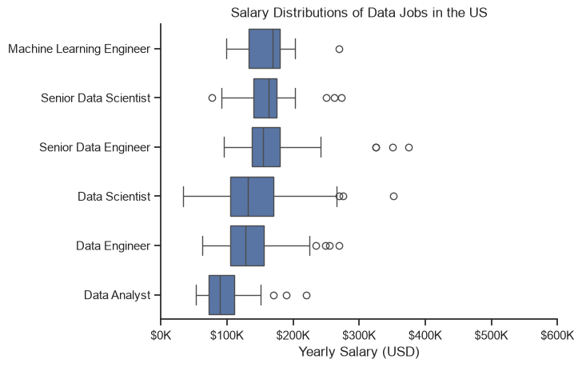

# Data Analyst Job Market Analysis

## Overview

Welcome to my **Data Analyst Job Market Analysis** project!

This project explores the **US Data Analyst job market** using real-world job posting data. The main goal is to understand which skills are most in-demand, which skills lead to higher-paying opportunities, and what aspiring Data Analysts should focus on to build a successful career.

The dataset used in this project is sourced from **Luke Barousse's Python Data Analytics Course** and contains detailed information about job titles, salaries, locations, and required skills. Using Python, I analyze this data through data cleaning, **Exploratory Data Analysis (EDA)**, and visualization to uncover valuable insights about the Data Analyst job market.

Through this project, I aim to demonstrate my skills in data analysis and provide data-driven insights that can help job seekers make better career decisions.

---

## The Questions

This project aims to answer the following questions:

1. What are the most in-demand skills for the top 3 most popular data roles?

2. How are in-demand skills trending for Data Analysts?

3. How well do Data Analyst jobs and skills pay?

4. What are the optimal skills for Data Analysts to learn?  
   *(High Demand AND High Paying)*

---

## Tools I Used

For this analysis, I used the following tools and technologies:

### Python

The main programming language used for data analysis and extracting insights.

### Python Libraries

- **Pandas** → Used for data cleaning, manipulation, and analysis.
- **NumPy** → Used for numerical operations.
- **Matplotlib** → Used for creating data visualizations.
- **Seaborn** → Used for creating advanced statistical visualizations.

### Jupyter Notebook

Used for writing and executing Python code, documenting analysis, and presenting findings.

### Visual Studio Code

Used as my development environment for writing and managing Python scripts.

### Git & GitHub

Used for version control, project management, and sharing my work publicly.
# Data Preparation and Cleanup
This section outlines the steps taken to prepare the data for analysis, ensuring accuracy and usability.

```python
# Importing Libraries
import ast
import pandas as pd
import seaborn as sns
from datasets import load_dataset
import matplotlib.pyplot as plt  

# Loading Data
dataset = load_dataset('lukebarousse/data_jobs')
df = dataset['train'].to_pandas()

# Data Cleanup
df['job_posted_date'] = pd.to_datetime(df['job_posted_date'])

df['job_skills'] = df['job_skills'].apply(
    lambda x: ast.literal_eval(x) if pd.notna(x) else x
)
```
## Filter US Jobs

To focus on the U.S. job market, I filtered the dataset and kept only job postings from the United States.

```python
df_US = df[df['job_country'] == 'United States']
```
# Analysis

This project analyzes different parts of the data job market. In this section, I focused on finding the most demanded skills for the top three popular data roles.

# 1. What are the most demanded skills for the top 3 most popular data roles?

To answer this question, I first identified the three most popular data roles. Then, I analyzed the skills required for each role and found the top 5 most demanded skills.

This analysis helps understand which skills are important for each data career path and which skills aspiring data professionals should focus on learning.
View my notebook with detailed steps here: [2_Skill_Demand.](Notebooks/2_Skill_Demand.ipynb)
# Visualize Data
```python
fig, ax = plt.subplots(len(job_titles), 1)


for i, job_title in enumerate(job_titles):
    df_plot = df_skills_perc[df_skills_perc['job_title_short'] == job_title].head(5)[::-1]
    sns.barplot(data=df_plot, x='skill_percent', y='job_skills', ax=ax[i], hue='skill_count', palette='dark:b_r')

plt.show()
```
### Results


*Bar graph visualizing the salary for the top 3 data roles and their top 5 skills associated with each.*
# Insights:
- SQL is the most requested skill for Data Analysts and Data Scientists, with it in over half the job postings for both roles. For - Data Engineers, Python is the most sought-after skill, appearing in 68% of job postings.
- Data Engineers require more specialized technical skills (AWS, Azure, Spark) compared to Data Analysts and Data Scientists who are - expected to be proficient in more general data management and analysis tools (Excel, Tableau).
- Python is a versatile skill, highly demanded across all three roles, but most prominently for Data Scientists (72%) and Data Engineers (65%).

## 2. How are in-demand skills trending for Data Analysts?

To analyze how skills are trending in 2023 for Data Analysts, I filtered Data Analyst job postings and grouped the skills by the month of the job postings. This helped identify the top 5 most demanded skills by month and visualize how skill demand changed throughout 2023.

View my notebook with detailed steps here: [3_Skills_Trend.](Notebooks/3_Skills_Trend.ipynb)
### Visualize Data
```python
from matplotlib.ticker import PercentFormatter

df_plot = df_DA_US_percent.iloc[:, :5]
sns.lineplot(data=df_plot, dashes=False, legend='full', palette='tab10')

plt.gca().yaxis.set_major_formatter(PercentFormatter(decimals=0))

plt.show()
```
### Results



*Bar graph visualizing the trending top skills for data analysts in the US in 2023.*

### Insights:

- **SQL** remained the most consistently demanded skill throughout 2023, maintaining its position as one of the most important skills for Data Analyst roles, despite a slight decline in demand over time.
- **Excel** showed a noticeable increase in demand toward the end of the year, becoming more competitive with other essential analytics skills such as Python and Tableau.
- **Python** maintained steady demand throughout 2023, highlighting its importance for data analysis, automation, and advanced analytics tasks.
- **Tableau** also showed relatively stable demand with minor fluctuations, continuing to be a valuable skill for data visualization and reporting.
- **Power BI** had lower demand compared to the other top skills but showed a positive upward trend, reflecting the growing importance of business intelligence and dashboarding tools.

## 3. How well do jobs and skills pay for Data Analysts?

To understand salary differences in data careers, I analyzed job postings from the United States and compared their median yearly salaries. First, I explored salary distributions for the most common data roles, including Data Analyst, Data Engineer, and Data Scientist, to identify which roles generally offer higher compensation.

View my notebook with detailed steps here: [4_Salary_Analysis](Notebooks/4_Salary_Analysis.ipynb).

#### Visualize Data

```python
sns.boxplot(
    data=df_US_top6,
    x='salary_year_avg',
    y='job_title_short',
    order=job_order
)

ticks_x = plt.FuncFormatter(lambda y, pos: f'${int(y/1000)}K')
plt.gca().xaxis.set_major_formatter(ticks_x)

plt.show()

```
### Results



*Bar graph visualizing the trending top skills for data analysts in the US in 2023.*
Box plot showing salary distributions for the top 6 data job titles in the US.

#### Insights

- There's a significant variation in salary ranges across different job titles. Senior Data Scientist positions tend to have the highest salary potential, with up to $600K, indicating the high value placed on advanced data skills and experience in the industry.

- Senior Data Engineer and Senior Data Scientist roles show a considerable number of outliers on the higher end of the salary spectrum, suggesting that exceptional skills or circumstances can lead to high pay in these roles. In contrast, Data Analyst roles demonstrate more consistency in salary, with fewer outliers.

- The median salaries increase with the seniority and specialization of the roles. Senior roles (Senior Data Scientist, Senior Data Engineer) not only have higher median salaries but also larger differences in typical salaries, reflecting greater variance in compensation as responsibilities increase.
### Highest Paid & Most Demanded Skills for Data Analysts

Next, I narrowed my analysis and focused only on data analyst roles. I looked at the highest-paid skills and the most in-demand skills. I used two bar charts to showcase these.

#### Visualize Data

```python

fig, ax = plt.subplots(2, 1)  

# Top 10 Highest Paid Skills for Data Analysts
sns.barplot(data=df_DA_top_pay, x='median', y=df_DA_top_pay.index, hue='median', ax=ax[0], palette='dark:b_r')

# Top 10 Most In-Demand Skills for Data Analystsr')
sns.barplot(data=df_DA_skills, x='median', y=df_DA_skills.index, hue='median', ax=ax[1], palette='light:b')

plt.show()

```

#### Results
Here's the breakdown of the highest-paid & most in-demand skills for data analysts in the US:


*Two separate bar graphs visualizing the highest paid skills and most in-demand skills for data analysts in the US.*

#### Insights:

- The top graph shows that specialized skills like `dplyr`, `Bitbucket`, and `GitLab` have higher median salaries, reaching close to $200K. However, these skills appear in fewer job postings.

- The bottom graph shows that common skills like `SQL`, `Excel`, and `PowerPoint` are the most demanded skills by employers. These skills may not have the highest salaries, but they are important for getting Data Analyst jobs.

- The results show that the highest-paying skills are not always the most demanded skills. Data Analysts should build a balanced skill set by learning both popular tools and specialized skills to improve career opportunities.

## 4. What Are the Most Optimal Skills to Learn for Data Analysts?

To identify the most optimal skills for Data Analysts — the skills that provide the best combination of **high demand and high salary potential** — I analyzed the relationship between skill demand percentage and median salary.

By comparing these two factors, I was able to identify which skills are the most valuable to learn for anyone looking to build a successful career in Data Analytics.

### Visualizing Optimal Skills

```python
from adjustText import adjust_text
import matplotlib.pyplot as plt

plt.scatter(
    df_DA_skills_high_demand['skill_percent'],
    df_DA_skills_high_demand['median_salary']
)

plt.xlabel('Skill Demand (%)')
plt.ylabel('Median Salary ($)')
plt.title('Most Optimal Skills for Data Analysts')
plt.show()
```

### Results
  

*A scatter plot visualizing the relationship between skill demand and median salary to identify the most valuable skills for Data Analysts in the US job market.*

### Insights

- **Oracle** appears to have one of the highest median salaries, reaching nearly **$97K**, despite being less common in job postings. This indicates that specialized database skills can provide strong earning potential.
- Commonly required skills like **Excel** and **SQL** appear frequently in job postings, making them essential skills for Data Analysts. However, their median salaries are lower compared to some specialized skills.
- Skills such as **Python**, **Tableau**, and **SQL Server** provide a strong balance between demand and salary, making them highly valuable skills to prioritize.
- The analysis suggests that combining programming, database, and visualization skills can significantly improve career opportunities in Data Analytics.

---

# Visualizing Skills by Technology Category

To gain deeper insights, I categorized Data Analyst skills into different technology groups:

- **Programming:** Python, R
- **Database:** SQL Server, Oracle
- **Analyst Tools:** Tableau, Power BI

This visualization helps understand which technology categories have the highest demand and salary potential.

### Visualizing Data

```python
import seaborn as sns
import matplotlib.pyplot as plt

scatter = sns.scatterplot(
    data=df_DA_skills_tech_high_demand,
    x='skill_percent',
    y='median_salary',
    hue='technology',
    legend='full'
)

plt.title('Optimal Data Analyst Skills by Technology Category')
plt.xlabel('Skill Demand (%)')
plt.ylabel('Median Salary ($)')
plt.show()
```

### Results
  
*A scatter plot visualizing the most optimal Data Analyst skills in the US job market, categorized by technology type.*

### Insights

- **Programming skills** (such as Python) generally appear at higher salary levels, showing the increasing value of programming expertise in modern Data Analytics.
- **Database skills** (such as Oracle and SQL Server) are linked with some of the highest salaries, highlighting the importance of data management and querying skills.
- **Analyst tools** (such as Tableau and Power BI) are widely used and offer competitive salaries, showing the importance of data visualization and reporting skills.
- A combination of programming, database, and visualization skills provides the strongest foundation for becoming a successful Data Analyst.

---

# What I Learned

Throughout this project, I developed a deeper understanding of the Data Analyst job market and improved my technical skills in Python-based data analysis.

Key learning outcomes include:

- **Advanced Python Usage:**  
  Improved my ability to use Python libraries such as **Pandas** for data manipulation and **Matplotlib/Seaborn** for data visualization.

- **Importance of Data Cleaning:**  
  Learned that proper data cleaning and preparation are essential before performing analysis to ensure accurate and reliable insights.

- **Skill-Based Career Analysis:**  
  Understood how analyzing skill demand, salary trends, and job availability can help make better career decisions.

- **Data Visualization:**  
  Improved my ability to create clear and meaningful visualizations that communicate complex information effectively.

---

# Key Insights

This project provided several important insights into the Data Analyst job market:

- **Demand and Salary Relationship:**  
  Skills that combine high demand and strong salary potential, such as **Python, SQL, Tableau, and database technologies**, provide excellent career opportunities.

- **Changing Market Trends:**  
  The Data Analytics industry continues to evolve, making continuous learning and adaptation important for long-term career growth.

- **Strategic Skill Development:**  
  Understanding market trends helps Data Analysts prioritize learning skills that provide the highest career value.

---

# Challenges I Faced

During this project, I faced several challenges that helped improve my analytical skills:

- **Data Inconsistencies:**  
  Handling missing values, duplicate records, and inconsistent data formats required careful data cleaning and validation.

- **Complex Data Visualization:**  
  Creating effective visualizations that clearly communicated insights from large datasets required experimentation and refinement.

- **Balancing Analysis Depth:**  
  Finding the right balance between detailed analysis and maintaining a clear overview of the dataset was challenging.

---

# Conclusion

This project provided valuable insights into the Data Analyst job market by exploring the relationship between skills, demand, and salary.

The analysis highlights that skills such as **Python, SQL, Tableau, Power BI, and database technologies** are highly valuable for Data Analysts.

Through this project, I strengthened my skills in **Python, data cleaning, visualization, and analytical thinking**. It also helped me understand how data-driven insights can support better career decisions.

This project represents an important step in my journey toward becoming a Data Analyst and eventually a Data Scientist.